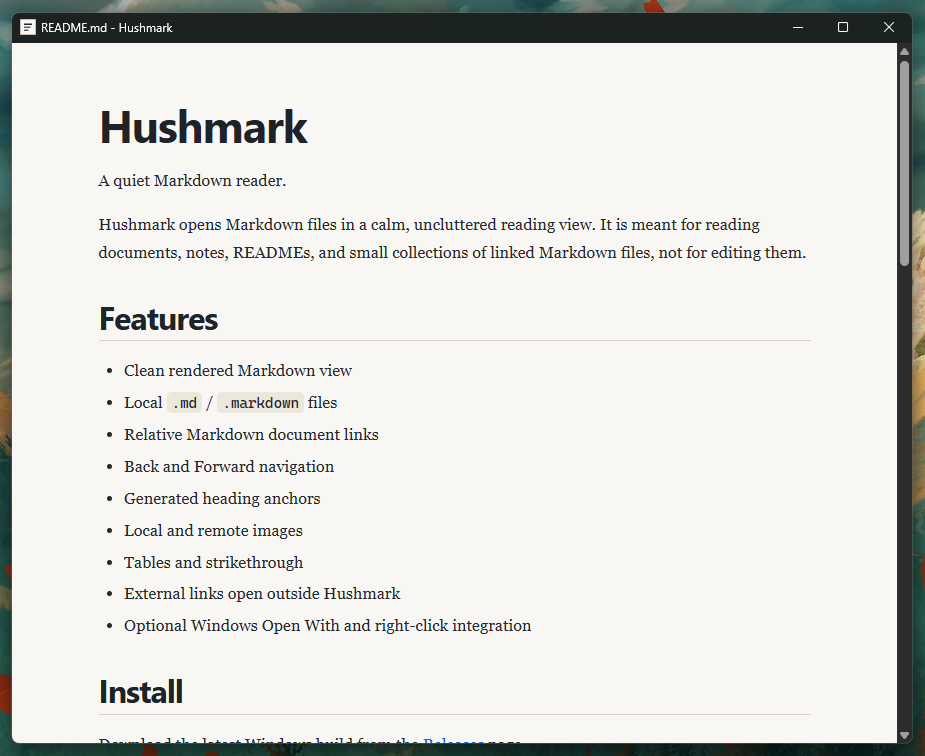

# Hushmark

A quiet Markdown reader.

Hushmark opens Markdown files in a calm, uncluttered reading view. It is meant for reading documents, notes, READMEs, and small collections of linked Markdown files, not for editing them.



## Features

- Clean rendered Markdown view
- Local `.md` / `.markdown` files
- Relative Markdown document links
- Back and Forward navigation
- Generated heading anchors
- Local and remote images
- Tables and strikethrough
- External links open outside Hushmark
- Optional Windows Open With and right-click integration

## Install

Download the latest Windows build from the [Releases](../../releases) page.

Current Windows builds are unsigned, so Windows may show a SmartScreen warning.

After opening Hushmark, you can use the setup view to add optional Windows integration for Markdown files.

Linux runtime support is available from the same source release. Linux desktop integration is handled by packaging rather than by an in-app setup flow.

## Use

Open a Markdown file by:

- double-clicking a file after Windows integration is enabled
- using **Open With**
- dragging a file onto Hushmark
- pressing **Ctrl+O**
- running Hushmark with a Markdown file path

Hushmark remembers document navigation while it is open, including Back and Forward between linked documents.

## Markdown support

Hushmark supports common Markdown reading features, including headings, links, images, tables, strikethrough, code blocks, blockquotes, and lists.

Raw HTML is sanitized before display.

More details are in [docs/markdown-support.md](docs/markdown-support.md).

## Platform status

Hushmark currently supports Windows and Linux. Windows has a standalone release executable and optional in-app desktop integration. Linux integration belongs to packages and desktop files rather than an in-app setup flow.

macOS may come later.

## Development

Hushmark is built with Rust, Tauri 2, TypeScript, HTML, and CSS.

Useful commands:

```sh
npm run build
cargo test --manifest-path src-tauri/Cargo.toml
npm run tauri -- build
```

Project notes for contributors and coding agents are in [AGENTS.md](AGENTS.md) and [docs/project-context.md](docs/project-context.md).

## License

Hushmark is licensed under the GNU General Public License v3.0 or later.

See [LICENSE](LICENSE).

The Hushmark name and branding are covered separately in [BRANDING.md](BRANDING.md).
