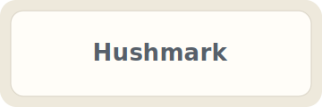

# H1 Markdown feature fixture

This document is a visual fixture for Hushmark's current Markdown rendering baseline. It should stay readable and contained without turning the app into an editor or a busy web page.

## Intra-document link checklist

These links should scroll within this document:

- [Jump to text formatting](#h2-text-formatting)
- [Jump to table alignment](#tables)
- [Jump to heading with spaces](#heading-with-spaces)
- [Jump to duplicate heading](#duplicate-heading)
- [Jump to second duplicate heading](#duplicate-heading-1)
- [Jump to install/update punctuation heading](#install-update)
- [Jump to punctuation-only heading](#heading)
- [Jump to Hebrew heading](#שלום-עולם)
- [Missing fragment should fail harmlessly](#missing-fragment)

The second sentence in this paragraph verifies ordinary paragraph spacing. The next two lines are separated by a soft line break:
this line follows a normal newline
and should remain part of the same paragraph.

This line ends with two spaces for a hard break.  
This line should start after a visible line break.

## H2 Text formatting

Plain text can include *emphasis*, **strong emphasis**, and ***strong emphasis with emphasis***.

Strikethrough is enabled: ~~this text is struck through~~.

Inline code should be visible but quiet: `cargo tauri dev -- examples\example.md`.

Escaped Markdown characters should remain visible: \*not emphasis\*, \# not a heading, \[not a link\].

### H3 Code blocks

```rust
fn main() {
    println!("Hello from a fenced Rust code block.");
}
```

```text
C:\Users\jonathan\Documents\Hushmark Test Files\A very long directory name with spaces\another very long directory name\markdown-feature-fixture-with-a-long-file-name-and-more-characters-than-usual.md
```

#### H4 Blockquotes

> A calm blockquote should feel related to the document, not like a warning panel.

> A nested quote starts here.
>
> > This is the nested quote.
> >
> > It should remain readable without becoming visually loud.

##### H5 Lists

Unordered list:

- First item
- Second item with `inline code`
- Third item
  - Nested unordered item
  - Another nested item

Ordered list:

1. First step
2. Second step
3. Third step
   1. Nested ordered step
   2. Another nested ordered step

###### H6 Links and images

External links should open outside Hushmark:

- [HTTPS link should open in the default browser](https://example.com)
- [Mail link should open in the default mail app](mailto:reader@example.com)
- [Unsupported FTP link should not navigate Hushmark](ftp://example.com/file.md)
- [Intra-document link should stay inside Hushmark](#tables)



The local placeholder above should render from `examples\assets\hushmark-placeholder.svg`.


---

## Tables

| Feature | Current behavior | Notes |
| --- | --- | --- |
| Tables | Enabled | Provided by `pulldown-cmark` table extension |
| Strikethrough | Enabled | Renders with `<del>` |
| Task lists | Not enabled | Stays as ordinary list text |

| Left aligned | Center aligned | Right aligned |
| :--- | :---: | ---: |
| apple | banana | 123 |
| longer left text | centered text | 456 |
| a much longer table cell that should not make the whole app unusable | middle | 789 |

## Heading anchor examples

Use the links near the top of this document to check generated heading anchors.

## Heading with spaces

This heading should receive the generated id `heading-with-spaces`.

## Duplicate heading

This first duplicate heading should receive the generated id `duplicate-heading`.

## Duplicate heading

This second duplicate heading should receive the generated id `duplicate-heading-1`.

## Install / Update

This punctuation heading should receive the generated id `install-update`.

## !!!

This punctuation-only heading should receive the fallback generated id `heading`.

## שלום עולם

This Hebrew heading should receive the generated id `שלום-עולם`.

## Unsupported extension examples

Task list syntax is intentionally not enabled:

- [x] Checked-looking item remains plain text
- [ ] Unchecked-looking item remains plain text

Footnote reference syntax is intentionally not enabled, so this should not become a numbered footnote.[^sample]

[^sample]: This definition is included to show that footnotes are not part of the current baseline.

# Heading attribute syntax stays visible {#custom-heading .quiet}

## Raw HTML and sanitization examples

The following raw HTML includes safe-looking tags and unsafe attributes. Hushmark sanitizes rendered HTML before display.

<div title="Raw HTML title">This raw HTML block may remain if it is considered safe by the sanitizer.</div>


<script>alert("This script should not appear or run.");</script>

[Dangerous JavaScript link should not keep its URL](javascript:alert("xss"))

## Long line behavior

This paragraph contains a very long unbroken token to check overflow handling: hushmark-long-token-aaaaaaaaaaaaaaaaaaaaaaaaaaaaaaaaaaaaaaaaaaaaaaaaaaaaaaaaaaaaaaaaaaaaaaaaaaaaaaaaaaaaaaaaaaaaaaaaaaaaaaaaaaaaaaaaaaaaaaaaaaaaaaaaaaaaaaaaaaaaaaaaaaaaaaaaaaaaaaaaaaaaaaaaaaaaaaaaaaaaaaaaaaaaaaaaaaaaaaaa.

```text
one-very-long-code-line-without-natural-breaks-aaaaaaaaaaaaaaaaaaaaaaaaaaaaaaaaaaaaaaaaaaaaaaaaaaaaaaaaaaaaaaaaaaaaaaaaaaaaaaaaaaaaaaaaaaaaaaaaaaaaaaaaaaaaaaaaaaaaaaaaaaaaaaaaaaaaaaaaaaaaaaaaaaaaaaaaaaaaaaaaaaaaaaaaaaaaaaaaaaaaaaaaaaaaaaaaaaaaaaaa
```

## Unicode and Hebrew

שלום עולם. זהו משפט בעברית כדי לבדוק תצוגת Unicode בסיסית.

This mixed paragraph includes English and עברית in the same line so Hushmark can be checked with bidirectional text in a normal reading flow.
