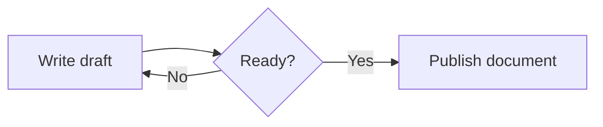
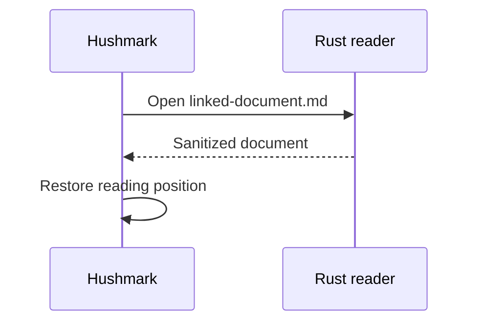
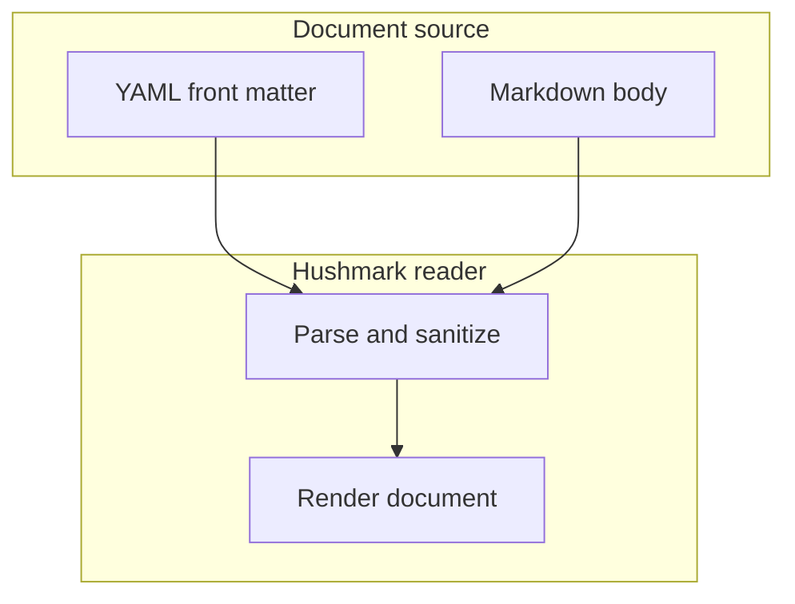
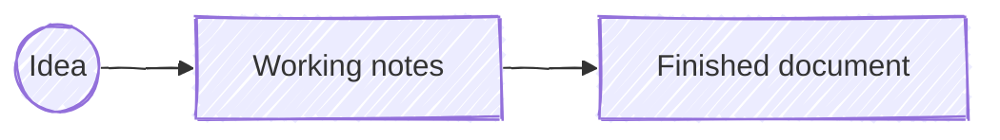
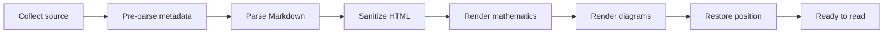

# Mermaid visual inspection

Mermaid diagrams should read as figures in the document rather than embedded application widgets. Test this file in Page and Full Width layouts, at several zoom levels, and in a narrow window.

## A compact flowchart

The diagram should be centered, legible, and visually compatible with the surrounding page.



## Sequence and accessible description

This diagram supplies author-written accessibility text. It should remain sharp when zooming and printing, with Mermaid's default participant labels visible at both the top and bottom.



## Nested structure

Subgraphs and labels with punctuation should have enough visual separation without resembling a UI panel.



## Author configuration

Ordinary Mermaid configuration remains part of the document. Security, HTML-label, resource-limit, font, and CSS-injection controls remain fixed by Hushmark.



## Wide diagram

The diagram must stay within the document measure without widening the entire window. Check that its labels remain usable at 50%, 100%, and 200% document zoom.



## Invalid source remains readable

The following malformed diagram should remain visible as a normal code block, with no partial or broken graphic.

```mermaid
flowchart LR
    Start -->
```

## Ordinary code remains code

Only a fenced block whose language is `mermaid` should become a diagram.

```text
flowchart LR
    This --> Stays --> Source
```

## Position after diagrams

Use this section to check same-document navigation and restoration after diagrams have changed the rendered document height.

[Return to the first diagram](#a-compact-flowchart)

The reader should return to the same passage after changing zoom or layout, navigating Back and Forward, and reopening this navigation entry.
